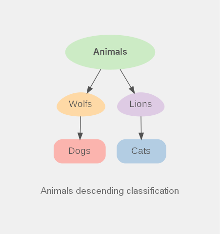

# DotHelloProject

My first **Graphviz Dot** project. Seems, I found one more tool to speed up my workflow &#x1F92F;

## Example diagrams

|Animals descending classification|Animals hierarchy tree|
|:---:|:---:|
|||

Look pretty cool &#x1F970;

## How to build?

Build diagrams with `build.ps1` script. It builds every diagram in current folder and places it in `output/` directory. It also includes some global styling for each `.dot` file.

## What i think

I will definitely use this tool in my projects for documentation, project management, project architecture etc. I like how Graphviz implemented color palettes, so I don't need to create custom palettes for beautiful diagrams.
